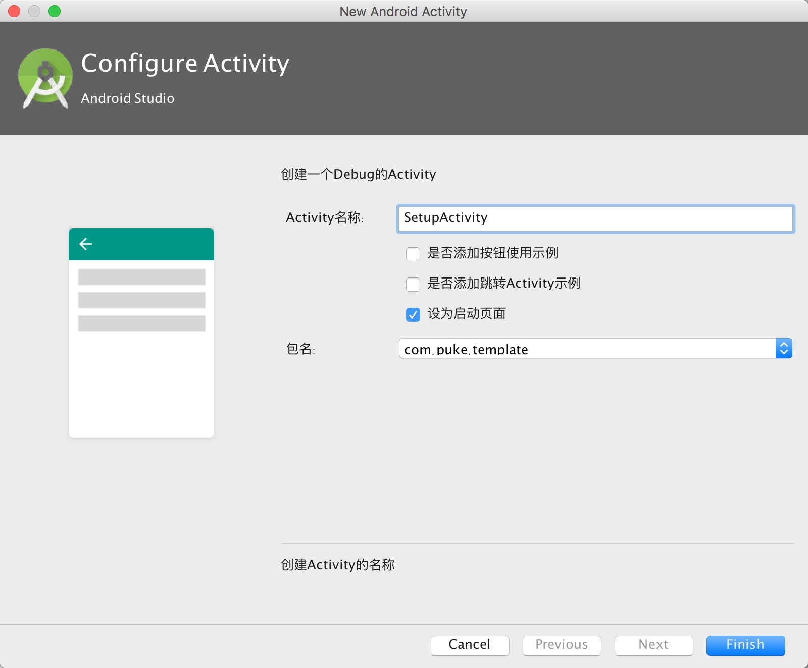

### DebugActivity

Android Studio Template模板，更多信息请访问 [博客](https://puke3615.github.io/2016/10/16/Android%20Studio%E6%A8%A1%E6%9D%BF%E4%B9%8B%E6%96%87%E4%BB%B6%E7%BB%84/)

##### 使用姿势

* 在`Android Studio安装目录/Contents/plugins/android/lib/templates`中新建个`Custom`文件夹
* `git clone`该目录并移到新建目录下
* 重启IDE即可生效

